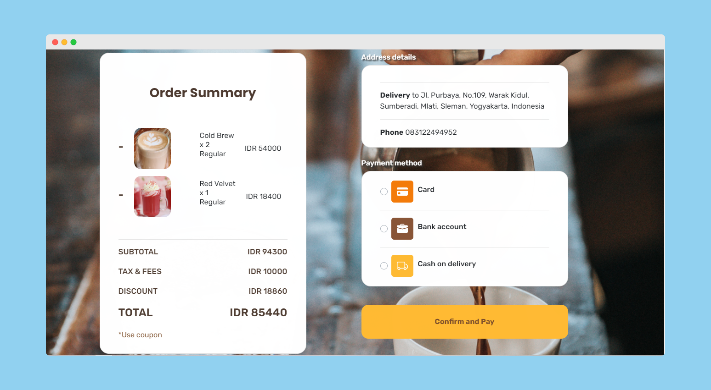

<h1 align='center'>Vue JS - Coffeeland - Coffeeshop</h1>
  <p align="center">
    <a href="https://coffeeland-shop.netlify.app/">View Demo</a>
    ·
    <a href="https://github.com/FirmanAzharR/coffeeLand-Backend/issues">Report Bug</a>
    ·
    <a href="https://github.com/FirmanAzharR/CoffeeLand-Vue/pulls">Request Feature</a>
  </p>



## About The Project

Coffeeland is an application developed to sell food and beverages in Coffeeland cafes. This application was developed using Express Js on the backend and Vue Js on the frontend.

## Built With

[](https://github.com/vuejs/vue)
[](https://github.com/bootstrap-vue/bootstrap-vue)

## Requirements

1. <a href="https://nodejs.org/en/download/">Node Js</a>
2. Node_modules `npm install` or `yarn install`
3. Backend API Coffeeland-Back-End [`here`](https://github.com/FirmanAzharR/coffeeLand-Backend)

## Getting Started

1. Download this Project or you can type `git clone https://github.com/FirmanAzharR/CoffeeLand-Vue`
2. Open app's directory in CMD or Terminal
3. Type `npm install` or `yarn install`
4. Add .env file at root folder project

```
VUE_APP_URL=localhost:5000
```

5. Type `npm run serve`

## Acknowledgements

- [Axios](https://www.npmjs.com/package/axios)
- [Vuex](https://vuex.vuejs.org/)

## License - TEAM GDJ

© [Firman Azhar Riyadi](https://github.com/FirmanAzharR)<br>
